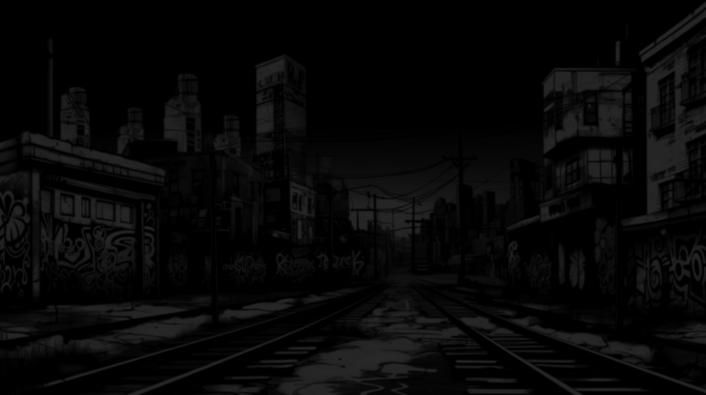

# 🎧 NOBS BEATS APP 🎵
> *Where Music Production Meets Innovation* ✨

<div align="center">
  
  <h1 style="position: relative; margin-top: -80px; color: #ffffff; text-shadow: 0 0 10px #ff00ff, 0 0 20px #00ffff; font-size: 3em; font-weight: 800;">NOBZ BEATS</h1>
</div>

<div align="center">
  
  [](https://www.youtube.com/@nobz_beats7894)
  [](https://soundcloud.com/user-621182531)
  
</div>

---

## 🚀 Features

### 🎵 Beats and Remixes
- 🔊 Browse and play my original beats and remixes
- 💿 Responsive audio player with vinyl spinning animation
- ❤️ Track likes and play count tracking
- 🌐 Global audio player with visualizer

### 🔬 Audio Analysis
- 🔍 Analyze audio files to determine key and tempo
- ⚡ Instant BPM and key detection
- 📁 Supports multiple audio formats (MP3, WAV, FLAC)

### 🎛️ Stem Separator
- ✂️ Split tracks into separate stems (vocals, drums, bass, melody)
- 💾 Download isolated components for remixing
- 🧠 Powered by Demucs high-quality audio separation model

### 🔄 Format Converter
- 🔄 Convert audio files between different formats (MP3, WAV, FLAC)
- 📲 Simple drag-and-drop interface
- 🚀 Fast processing with automatic download

### 📹 YouTube to Audio
- 📺 Extract audio from YouTube videos or playlists
- 🎚️ Select desired output format
- 📦 Batch conversion supported

### 🎓 Production Guides
- 🤖 Interactive AI chatbot (Alex) for music production advice
- 💡 Instant answers to music production questions
- 📝 Tips on beatmaking, mixing, and music theory

### 🎨 Design Features
- 📱 Responsive design for mobile and desktop
- 🎧 Custom vinyl loading animation
- 🌈 Modern gradient effects and CRT-style animations
- 🌙 Dark theme optimized for producers

---

## 🛠️ Tech Stack

<div align="center">
  
  
  
  
  
  
</div>

- **🔙 Backend**: Flask (Python)
- **🗄️ Database**: SQLite with SQLAlchemy ORM
- **🔐 User Authentication**: Flask-Login
- **🎚️ Audio Processing**: 
  - 🎵 librosa (audio analysis)
  - 🔊 demucs (stem separation)
  - 📺 yt-dlp (YouTube download)
  - 🎞️ FFmpeg (format conversion)
- **🧠 AI Integration**: LLaMA 3.3 70B via Together API
- **🎨 Frontend**: 
  - 💻 JavaScript (Vanilla)
  - 🎭 Custom CSS with modern animations
  - 📱 Responsive design
  - 🎧 Global audio player with visualizer

---

## ⚙️ Installation

### Prerequisites
- 🐍 Python 3.8+
- 🎬 FFmpeg
- 📦 Node.js (optional, for development)

### Setup

1️⃣ Clone the repository
```bash
git clone https://github.com/yourusername/music-production-toolkit.git
cd music-production-toolkit
```

2️⃣ Create and activate a virtual environment
```bash
python -m venv venv
source venv/bin/activate  # On Windows: venv\Scripts\activate
```

3️⃣ Install dependencies
```bash
pip install -r requirements.txt
```

4️⃣ Set up environment variables
Create a `.env` file in the project root:
```
TOGETHER_API_KEY=your_together_api_key
```

5️⃣ Initialize the database
```bash
flask shell
>>> from app import db
>>> db.create_all()
>>> exit()
```

6️⃣ Run the application
```bash
python app.py
```

7️⃣ Access the application at `http://localhost:5000`

---

## 📂 Project Structure

```
music-production-toolkit/
│
├── 🚀 app.py                 # Main application file
├── 🔌 extensions.py          # Flask extensions
├── 📝 forms.py               # Flask-WTF form classes
├── 💾 models.py              # Database models
├── 📋 requirements.txt       # Python dependencies
│
├── 📁 static/                # Static files
│   ├── 🎨 css/               # CSS stylesheets
│   │   ├── base.css        # Base styles
│   │   ├── hero.css        # Hero section styles
│   │   ├── navigation.css  # Navigation styles
│   │   ├── audio-player.css # Audio player styles
│   │   └── ...            # Other style files
│   ├── 📜 js/                # JavaScript files
│   ├── 🔤 fonts/             # Custom fonts
│   ├── 🖼️ images/            # Images and graphics
│   ├── 📤 uploads/           # Uploaded audio files
│   └── 🔄 converted/         # Processed audio files
│
└── 📄 templates/             # HTML templates
    ├── base.html          # Base template with global player
    ├── home.html          # Homepage template
    ├── about.html         # About page template
    ├── showcase.html      # Track showcase template
    ├── analyzer.html      # Audio analysis template
    ├── separator.html     # Stem separator template
    ├── converter.html     # Format converter template
    ├── youtube.html       # YouTube downloader template
    ├── guides.html        # Production guides template
    └── admin.html         # Admin panel template
```

---

## 📖 Usage

### 🔍 Audio Analysis
1. 📂 Upload an audio file (MP3, WAV, FLAC)
2. 🔘 Click "Analyze"
3. 👁️ View the detected BPM and musical key

### ✂️ Stem Separation
1. 📂 Upload a song file
2. 🔘 Click "Separate Stems"
3. 💾 Download individual stems (vocals, drums, bass, melody)

### 🔄 Format Conversion
1. 📂 Upload an audio file
2. 🎯 Select the desired output format
3. 🔘 Click "Convert"
4. 💾 Download the converted file

### 📺 YouTube to Audio
1. 📋 Paste a YouTube URL (video or playlist)
2. 🎯 Select the output format
3. 🔘 Click "Convert"
4. 💾 Download the audio file

### 🤖 AI Production Guide
1. 💬 Type a question about music production
2. 📚 Receive instant guidance from Alex, the production assistant
3. 🔍 Use suggested topics or ask custom questions

---

## 👑 Admin Features

### 🎵 Track Management
- 📤 Upload new tracks with artwork
- ✏️ Edit track information
- 🗑️ Delete tracks
- 🎛️ Manage the showcase library

---

## 🤝 Contributing

1. 🍴 Fork the repository
2. 🌿 Create a feature branch: `git checkout -b feature/amazing-feature`
3. 💾 Commit your changes: `git commit -m 'Add amazing feature'`
4. 📤 Push to the branch: `git push origin feature/amazing-feature`
5. 🔍 Open a pull request

---

## 📜 License

This project is licensed under the MIT License - see the LICENSE file for details.

---

## 🔗 Connect With Me

<div align="center">
  
  [](https://www.youtube.com/@nobz_beats7894)
  [](https://soundcloud.com/user-621182531)
  
</div>

---

## 🙏 Acknowledgments

- 🎛️ [Demucs](https://github.com/facebookresearch/demucs) for the stem separation technology
- 🎵 [librosa](https://librosa.org/) for audio analysis capabilities
- 📺 [yt-dlp](https://github.com/yt-dlp/yt-dlp) for YouTube extraction
- 🧠 [LLaMA](https://ai.meta.com/llama/) by Meta for the AI assistant technology
- 🤝 [Together](https://www.together.ai/) for AI API services

---

<div align="center">
  
  ### 🎵 Made with ❤️ by NOBZ BEATS 🎧
  
</div>
